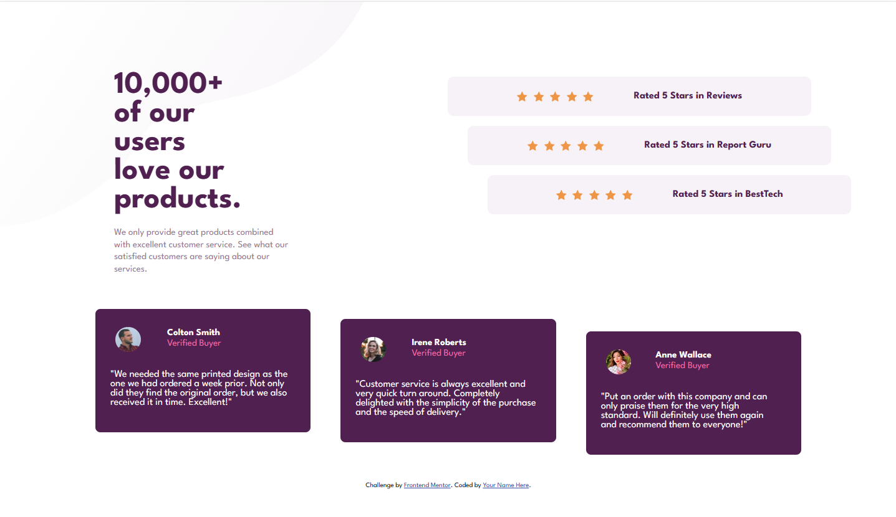

# Frontend Mentor - Social proof section

Esta é uma solução para o [desafio da seção de provas sociais no Frontend Mentor](https://www.frontendmentor.io/challenges/social-proof-section-6e0qTv_bA).

## Índice

- [Visão geral](#visão-geral)
  - [O desafio](#o-desafio)
  - [Captura de tela](#captura-de-tela)
- [Processo](#processo)
  - [Construído com](#construído-com)
- [Autor](#autor)

## Visão geral

### O desafio

Os usuários devem ser capazes de:

- Veja o layout ideal para a seção, dependendo do tamanho da tela do dispositivo

### Captura de tela
Desktop - 1440px

Mobile - 375px

## Processo

### Construído com

- HTML5
- CSS3
- Flexbox
- Responsividade
- Mobile-first

## Autor

- Frontend Mentor - [@luanmizohata](https://www.frontendmentor.io/profile/luanmizohata)
- Linkedin - [@luanestrela](https://www.linkedin.com/in/luanestrela/)
